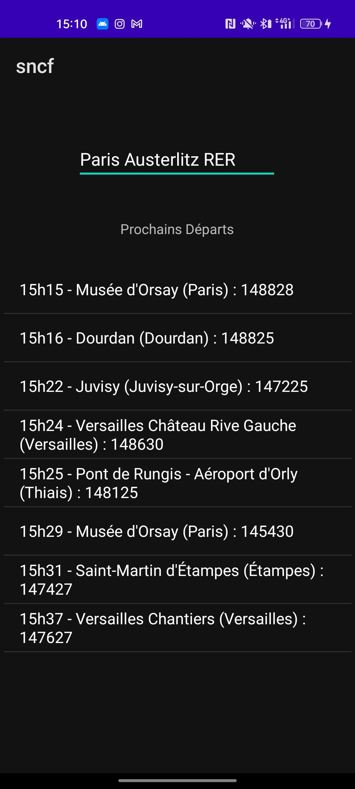
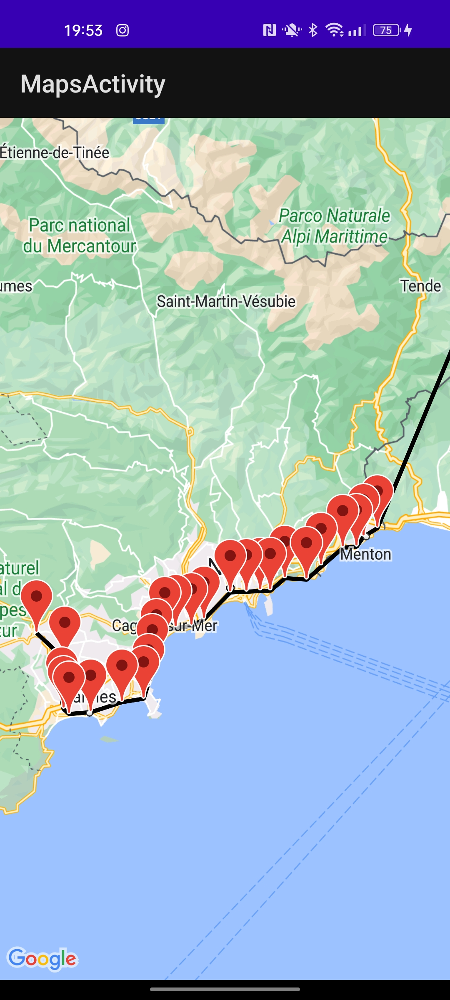
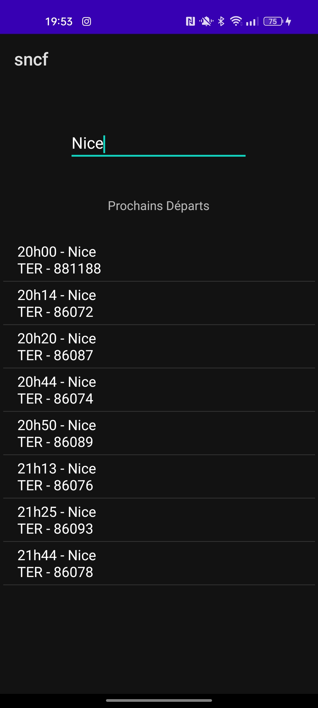

# Android Kotlin App

## Description

This app had for objective to learn Android and Kotlin by using the [SNCF Api](https://numerique.sncf.com/startup/api/) to fetch trains at departures from a selected station

## Screenshots

### V2

## License

This project is licensed under the MIT License - see the [LICENSE](LICENSE) fil for details.

## Author

- [Hokanosekai](https://github.com/Hokanosekai) - _Initial work_

## Aknowledgements

- [SNCF Api](https://numerique.sncf.com/startup/api/)
- [Nativia Playground](https://playground.nativia.io)
